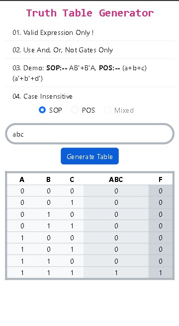

Sure, here's a README file template for your Truth Table Generator:

---

# Truth Table Generator

The Truth Table Generator is a web-based tool designed to quickly and accurately generate truth tables for logical expressions. It simplifies complex logic expressions, visualizes logical relationships, and streamlines decision-making processes.



## Features

- **Intuitive Interface:** User-friendly interface for easy input of logic expressions.
- **Support for Various Syntax Formats:** Supports standard notation, logical operators, and Boolean algebra expressions.
- **Multiple Input Types:** Choose from SOP (Sum of Products), POS (Product of Sums), or Mixed input types.
- **Syntax Validation:** Ensures that only valid logic expressions are accepted.
- **Case Insensitivity:** Expression parsing is case-insensitive for convenience.
- **Responsive Design:** Works seamlessly on desktop and mobile devices.

## Usage

1. Enter a valid logic expression into the input field.
2. Select the input type (SOP, POS, or Mixed) using the radio buttons.
3. Click the "Generate Table" button to generate the truth table.
4. View the generated truth table below the input area.

## Examples

- **SOP (Sum of Products):** `A'B + AB'`
- **POS (Product of Sums):** `(A + B')(A' + B)`
- **Mixed:** `(A + B)(C'D' + A'B')`

## Installation

1. Clone the repository:

   ```bash
   git clone https://github.com/ManmohanKhandelwal/truth-table-generator.git
   ```

2. Open `index.html` in your web browser.

## Contributing

Contributions are welcome! Please feel free to open issues or pull requests for any improvements or feature requests.

## License

This project is licensed under the MIT License - see the [LICENSE](LICENSE) file for details.

---

Feel free to customize this template according to your project's specific details and requirements. If you have any questions or need further assistance, don't hesitate to ask!
